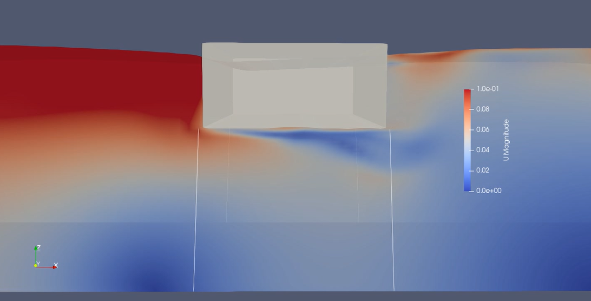
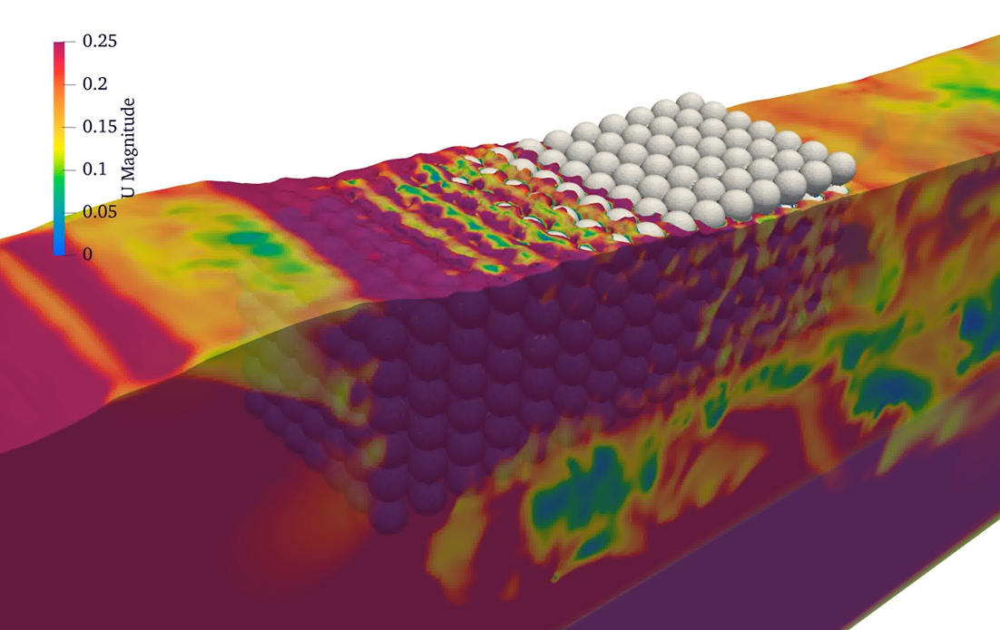
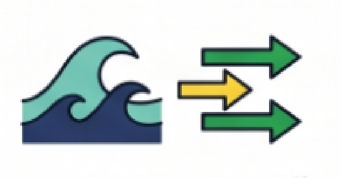
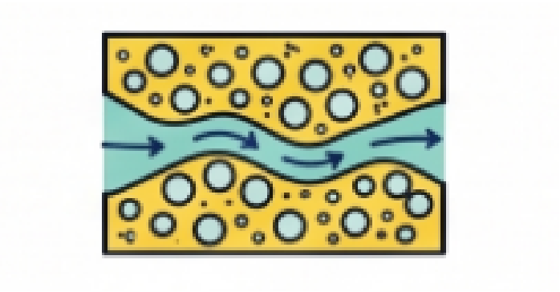
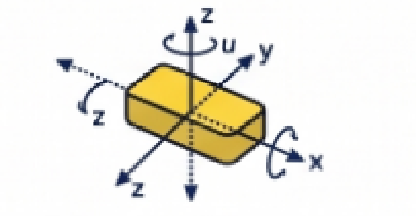
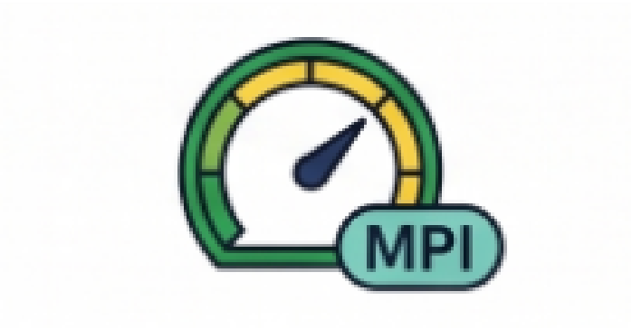
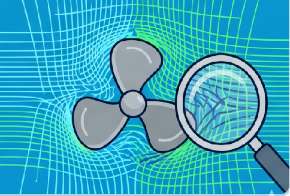

# FloatingPorousFoam


<p align="center">
  
  
</p>

<p align="center">
  <b>A specialized OpenFOAM library for simulating the interaction between waves, currents, and floating porous structures.</b>
</p>


---

## 📋 Table of Contents
- [Description](#-description)
- [Features](#-features)
- [Prerequisites](#-prerequisites)
- [Installation](#-installation)
- [Usage & Configuration](#-usage--configuration)
- [Publications](#-publications)
- [Acknowledgements](#-acknowledgements)

---

## 📖 Description

**FloatingporousFoam** is an open-source solver developed to address the complex hydrodynamics of porous structures in marine environments. It extends the capabilities of standard OpenFOAM solvers to handle porous structure motion, high-fidelity flow resolution, and coupling with mooring dynamics.

This library is particularly useful for **coastal engineering applications**, such as:
*   Floating porous breakwaters
*   Aquaculture cages
*   Permeable marine barriers
*   Porous membranes

---


## ✨ Features

<table align="center">
  <tr>
    <td align="center" width="33%">
      <br>
      <br><b>Wave-current coupling</b>
    </td>
    <td align="center" width="33%">
      <br>
      <br><b>Porous media dynamics</b>
    </td>
    <td align="center" width="33%">
      <br>
      <br><b>Rigid body 6DoF</b>
    </td>
  </tr>
  <tr>
    <td align="center" width="33%">
      <br>
      <br><b>High performance</b>
    </td>
    <td align="center" width="33%">
      <br>
      <br><b>Mooring system</b>
    </td>
    <td align="center" width="33%">
      <br>
      <br><b>Dynamic/overset mesh</b>
    </td>
  </tr>
</table>

* **Porous Structure Motion**: Simulation of 6-DoF porous body kinematics under wave and current loads.
* **Versatile Mesh Adapters**: Support for **Dynamic Mesh** and **Overset Mesh** topologies to handle large-amplitude body motions.
* **Mooring System Coupling**: Integration with `foamMooring` for transient dynamic restoring force computation.
* **MPI Parallel Acceleration**: Distributed computing architecture design for large-scale hydrodynamic mesh simulations.
* **Internal Flow & Dissipation Mapping**: Resolution of intra-pore velocity fields and quantification of turbulent energy dissipation.
* **Fully Resolved Models**: Pore-scale simulation of flow through and around explicit porous skeleton geometries.
---


## 🛠 Prerequisites

Before installing, ensure the following libraries are present in your environment.

| Dependency | Version | Link | Notes |
| :--- | :--- | :--- | :--- |
| **OpenFOAM** | `v2206` | [OpenFOAM.com](https://www.openfoam.com/) | **Strictly tested on v2206**. |
| **olaFlow** | Latest | [GitHub](https://github.com/phicau/olaFlow) | Required for wave generation/absorption. |
| **foamMooring**| Master | [GitLab](https://gitlab.com/hfchen20/foamMooring) | Required only for moored cases. |

---

## 🚀 Installation

### 1. Download Source Code
Clone this repository or copy the source folder to your OpenFOAM user directory (`$WM_PROJECT_USER_DIR`).

```bash
# Option A: Git Clone (Recommended)
cd $WM_PROJECT_USER_DIR
git clone https://github.com/Dylan000112/floatingporousFoam.git

# Option B: Manual Copy
cp -r floatingporousFoam $WM_PROJECT_USER_DIR/
```

### 2. Compile
Navigate to the directory and execute the make script.

```bash
cd $WM_PROJECT_USER_DIR/floatingporousFoam

# Clean previous builds (optional)
./Allwclean

# Compile library and solvers
./Allwmake
```

---

## 💻 Usage & Configuration

### 1. ControlDict Setup
You must load the appropriate libraries in `system/controlDict` depending on your simulation strategy.

#### A. For Dynamic Mesh Cases
Use this configuration for standard mesh deformation:
```cpp
libs
(
    "libporoussixDoFRigidBodyMotion.so"
);
```

#### B. For Overset Mesh Cases
Use this configuration when using overset (chimera) meshes:
```cpp
libs
(
    "liboversetPadding.so"
    "libporoussixDoFRigidBodyMotion.so"
);
```

### 2. Running the Solver
Run the simulation using the custom solver:

```bash
porousolaDyMFlow
```

---
## 📚 Publications

If you use this code or methodology in your research, please consider citing our work:

* **Dong, Y.**, Tan, W., Chen, H., & Yuan, J. (2024). Numerical modeling of wave interaction with a porous floating structure consisting of uniform spheres. *Physics of Fluids*, 36(8), 087133. [](https://doi.org/10.1063/5.0222161)

* **Dong, Y.**, Dai, J., Pan, Y., & Yuan, J. (2026). Wave attenuation mechanism and geometry optimization of a π-shaped porous floating breakwater: A numerical study. *Physics of Fluids*, 38(5), 055140. [](https://doi.org/10.1063/5.0324644)


BibTeX Citation:

```bibtex
@article{Dong2024,
  author = {Dong, Yiyong and Tan, Weikai and Chen, Hao and Yuan, Jing},
  title = {Numerical modeling of wave interaction with a porous floating structure consisting of uniform spheres},
  journal = {Physics of Fluids},
  volume = {36},
  number = {8},
  pages = {087133},
  year = {2024},
  doi = {10.1063/5.0222161}
}

@article{Dong2026,
  author = {Dong, Yiyong and Dai, Jingfeng and Pan, Yingwang and Yuan, Jing},
  title = {Wave attenuation mechanism and geometry optimization of a $\pi$-shaped porous floating breakwater: A numerical study},
  journal = {Physics of Fluids},
  volume = {38},
  number = {5},
  pages = {055140},
  year = {2026},
  doi = {10.1063/5.0324644}
}
```
---

## 👏 Acknowledgements

*   **[OpenFOAM](https://openfoam.org/)**: The open source CFD toolbox.
*   **[olaFlow](https://github.com/phicau/olaFlow)**: Developed by *Higuera et al.* for simulating wave and porous structure interactions.
*   **[foamMooring](https://gitlab.com/hfchen20/foamMooring/-/tree/master/)**: Developed by *Haifei Chen* for mooring restraints in OpenFOAM.

---

<p align="right">(<a href="#top">back to top</a>)</p>
