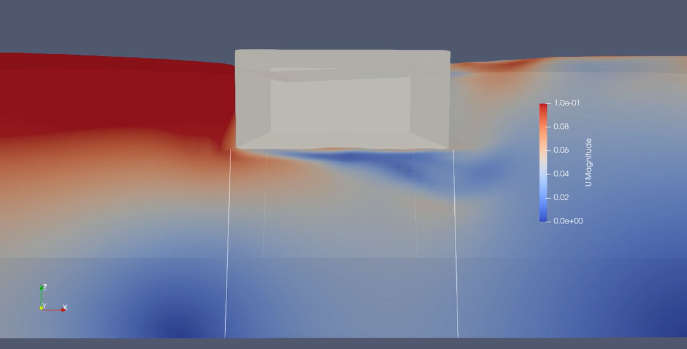

# floatingporousFoam

**floatingporousFoam** is a library for simulating porous structure's motion under wave and current in OpenFOAM

## Usage
needs:

**olaFlow**

**foamMooring**

## Installation
1. Copy the `floatingporousFoam` floder to `$WM_PROJECT_USER_DIR`.
2. Run `./Allwmake`.
3. Include the following lines in your `contorlDict` and `dynamicmeshDict` file:
   
   `libs
      (
        poroussixDoFRigidBodyMotion
      );`
   
   `motionSolverLibs
      (
        poroussixDoFRigidBodyMotion
      );`
4. Run your case with `porousolaDyMFlow`

## Publications
Yiyong Dong, Weikai Tan, Hao Chen, Jing Yuan; Numerical modeling of wave interaction with a porous floating structure consisting of uniform spheres. Physics of Fluids 1 August 2024; 36 (8): 087133. https://doi.org/10.1063/5.0222161

## Acknowledgements
**OpenFOAM** is free, open source software for computational fluid dynamics (CFD), developed primarily by CFD Direct, on behalf of the OpenFOAM Foundation.

**olaFlow** is a library for ..., developed by ...

**foamMooring** is a toolbox used to ..., developed by ...
